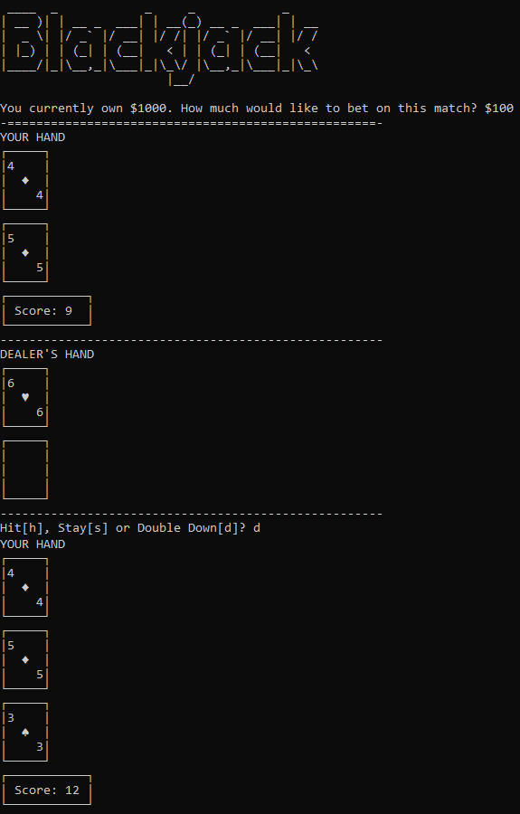
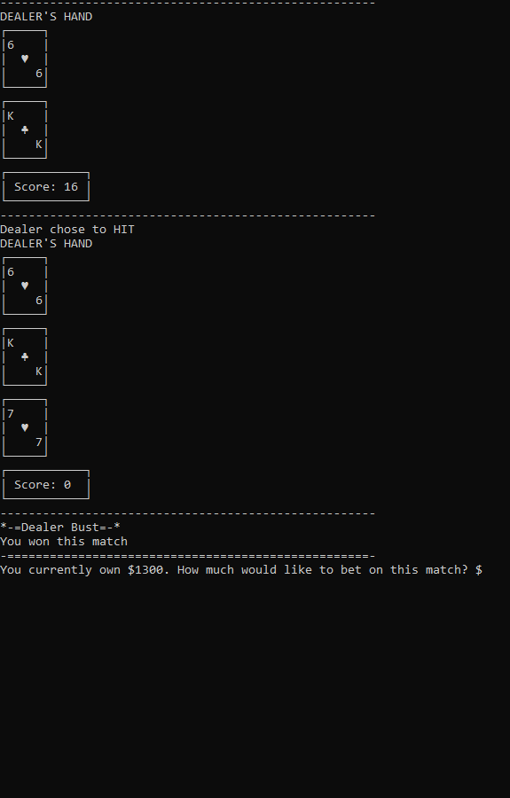

<h1 align="center"> Blackjack Game (NLW #10) </h1>

Blackjack game on the command-line interface.

  <a href="#-technologies">Technologies</a>&nbsp;&nbsp;&nbsp;|&nbsp;&nbsp;&nbsp;
  <a href="#-project">Project</a>&nbsp;&nbsp;&nbsp;|&nbsp;&nbsp;&nbsp;
  <a href="#-blackjack rules/how to play">Blackjack rules/How to play</a>&nbsp;&nbsp;&nbsp;|&nbsp;&nbsp;&nbsp;
  <a href="#memo-license">License</a>

  

 

  
  

## 🚀 Technologies

This project was developed using:

- Python

## 💻 Project

Blackjack game on the command-line interface developed as the final project for the course CS50's Introduction to Programming with Python, by Harvard.

## :black_joker: Blackjack rules/How to play

PLAYING:
1 - Player places bet.
2 - 2 cards are dealt to the player and 2 are dealt to the dealer (one is shown and the other is kept facing down).
    If, at any moment, player gets a score of 21, they win(aka 'blackjack')
3 - Player chooses to either: 
        "hit": get +1 card (they can keep hitting until decide to "stay" or "double down"), 
        "stay": skip their turn, or
        "double down": if the player's score is between 9 and 11, they can choose to double the bet for a 'hit' followed by 'stay'.
    If the score goes over 21 while hitting, player loses(aka 'bust').
4 - Dealer reveals his hidden card.
    If dealer's score is 16 or less, he is forced to hit.
        If the score goes over 21 while hitting, dealer loses(aka 'bust').
    Else, dealer's forced to stay.
5 - Both scores are compared.
    If player's score is higher than the dealer's, player wins his bet (gets the amount he betted * 2).
    Else, if it's a tie(aka 'push'), player gets his original bet back.
    else, dealer wins and gets the amount betted.

The game ends when the player runs out of money

CARD POINTS:
Ace = 1 or 11 points (whichever is better for the player)
Jack/Queen/King = 10 points
2 - 10 = face value (2 = points, 3 = 3 points...)

## :memo: License

This project is under MIT license.

---